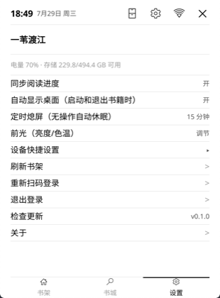
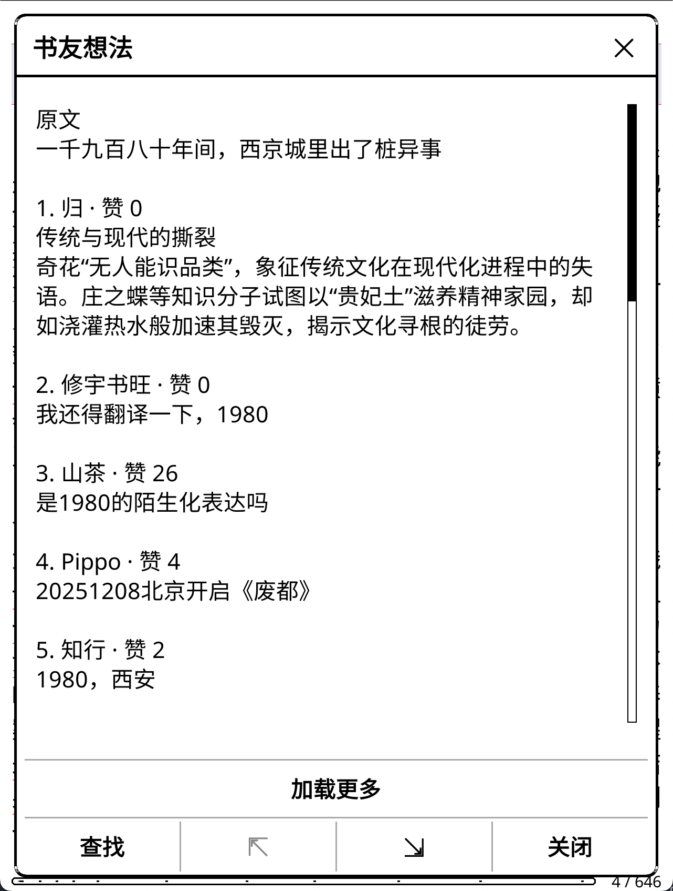

# 微读 (WeRead Desktop)

把微信读书搬到 KOReader 桌面：启动即是你的微信书架，支持扫码登录、书城浏览、全书下载、划线评论，以及阅读进度、时长和已读状态云同步。适用于 Kindle 及其他运行 KOReader 的设备。

## 功能

- **微信读书书架桌面**：启动和退出书籍时直接显示微信书架（封面、已读标记），而不是 KOReader 文件管理器
- **扫码登录**：与微信读书官方 App 相同的二维码登录方式
- **书城**：浏览书城推荐、搜索书籍
- **全书下载**：把书架上的书打包成单个 EPUB 下载到本地阅读
- **划线与书友想法**：下载微信读书划线；点击任一下划线按需加载当前范围的书友想法，已知有评论的位置带星号，并支持缓存和「加载更多」
- **书友点评**：阅读微信书籍时可从 KOReader 工具菜单查看整本书的精选点评
- **书架搜索与排序**：书架内可按书名/作者筛选，并按最近阅读、书名、进度或未读完排序
- **阅读统计**：设置页可查看本周和累计阅读统计
- **缓存管理**：设置页查看微读缓存占用；长按已下载书籍可删除本地 EPUB、章节和评论缓存
- **出版社注释**：将书中出版社注释转换为标准 EPUB 脚注，点击后使用 KOReader 原生弹窗显示
- **可恢复的双向进度同步**：
  - 在线上传：正常联网阅读时，每 30 秒及打开/关闭书籍时自动上报进度和新增的有效阅读时长；休眠时间不会计入
  - 下载：打开书时自动拉取云端进度，比本地新就跳转到最新位置（在手机微信读书上读的进度可以无缝接续）
  - 离线/崩溃恢复：待上传位置和阅读时长先落盘；联网后只静默补传最新进度，历史离线时长继续保留在本地，书籍已经关闭也不需要重新打开
  - 离线时长管理：设置页显示待上报时长；用户可手动开始后台上报，或只清除待上报时长而保留阅读进度
  - 可靠补报：手动上报按每次最多 60 秒、间隔 61 秒串行处理；中断后保留剩余部分，只有收到云端 `synckey` 确认才扣减本地队列
  - 补报期间阅读：可以继续阅读微信书籍；实时进度仍会以 `rt=0` 更新，补报开始前的历史时长与期间新增时长分开保存，不会被重复扣减或用旧位置覆盖新进度
- **已读状态同步**：KOReader 读完弹窗中的「标记为读完/继续阅读」同步到微信读书云端；离线或失败时保留状态并在联网后重试
- **状态栏**：时间、Wi-Fi 状态、设置和退出入口
- **定时熄屏**：设置标签页可调整无操作自动休眠时长（关 / 5 / 15 / 30 / 60 分钟，复用 KOReader 内置 autosuspend 插件，默认 15 分钟）
- **设备快捷设置**：设置标签页提供前光（亮度/色温）、夜间模式、Wi-Fi、屏幕旋转、屏保类型、时钟格式（12/24 小时制）开关，全部走 KOReader 官方公开接口；顶部显示电量和存储状态
- **检查更新**：设置页可选择稳定版、Beta 测试版或 Alpha 实验版，并手动检查 GitHub Releases；发现新版本可一键下载安装（发布流程见下文「发布」）

## 截图

<p align="center">
  
  
  
</p>
<p align="center">
  
  
  
</p>

## 安装

1. 安装 [KOReader](https://github.com/koreader/koreader)（仅在 2026.07 版本验证过；插件依赖若干 KOReader 内部接口，见下文「KOReader 兼容性」，过旧或过新的版本可能不兼容）。
2. 把 `wereaddesktop.koplugin` 目录复制到 KOReader 的 `plugins/` 目录下。
3. 重启 KOReader，首次启动会弹出微信读书扫码登录。

启动时是否显示桌面取决于「启动时显示」设置：「历史记录」「收藏」「文件夹快捷方式」模式下不显示，其余模式（含默认的「文件管理器」）显示；退出书籍时始终回到桌面（可在「微读」菜单关闭）。

## 使用

- **书架**：点封面打开已下载的书；未下载的书会提示下载整本 EPUB；长按已下载书籍可补齐缺失章节、重新下载整本或删除本地缓存
- **本地筛选**：书架顶部搜索框只筛选本地已同步书架，不会修改微信读书云端数据；设置页可循环切换排序方式
- **书城**：底部「书城」标签浏览推荐和搜索，搜索到的书同样可以下载
- **下载补齐**：整本下载时部分章节失败，完成提示里可直接「补齐缺失章节」——只重下失败的章节并重新打包，已下载的章节来自本地缓存
- **划线评论**：点击橙色下划线打开「书友想法」；带星号表示已知存在公开评论，普通热门划线也可点击，无评论时会显示空状态。评论按当前范围懒加载，不会在下载整本书时批量请求
- **整本点评**：阅读微信书籍时，从 KOReader 主菜单「工具 → 书友点评」查看整本书精选点评
- **标记读完**：读到书末后使用 KOReader 的读完弹窗，状态会同步到微信读书；同步失败会保留待办并在重新联网或再次打开书籍时重试
- **设置**：底部「设置」标签或右上角齿轮打开 KOReader 设置菜单；「微读」菜单项在 KOReader 主菜单的「工具」分类下，可开关自动桌面、进度同步、登录/退出
- **缓存与统计**：设置页的「微读缓存」显示本地占用和书籍明细；「阅读统计」读取微信读书本周/累计数据；长按已下载书籍可删除本地缓存
- **进度与离线时长**：阅读进度默认开启同步，离线进度会在联网后以 `rt=0` 静默补传；离线阅读时长保留在本地，可在设置页「离线阅读时长」中选择后台上报或清除。后台补报耗时约为“分片数减一 × 61 秒”，期间设备会保持唤醒并可继续阅读；补报任务只处理启动时已经存在的历史时长，期间新增时长会独立保留，任务结束后可再次上报。由于服务端计时吞吐约为每分钟 60 秒，持续阅读时待上报总量可能暂时不会下降

## 开发

项目结构：

```
wereaddesktop.koplugin/
├── main.lua              -- 插件入口：桌面生命周期、菜单、进度同步接线
├── desktop.lua           -- 书架桌面 widget（书架/书城/设置三个标签页）
├── wereadbridge.lua      -- UI 与微信读书客户端库之间的桥接层
├── progressuploader.lua  -- 阅读进度双向同步与离线队列补传
├── weread/               -- 微信读书协议、下载、划线与评论客户端库（衍生自 weread.koplugin，见 NOTICE）
│   └── lib/storage.lua   -- 本地缓存统计与安全删除
└── spec/                 -- 无头测试（luajit 直接运行）
```

运行确定性无头测试：

```sh
cd wereaddesktop.koplugin
luajit spec/test_progress_sync.lua
luajit spec/test_posupdate_wiring.lua
luajit spec/test_desktop_overlays.lua
luajit spec/test_lazy_thoughts.lua
luajit spec/test_lazy_thought_downloader.lua
luajit spec/test_lazy_thought_reader.lua
luajit spec/test_book_reviews_client.lua
luajit spec/test_book_reviews_reader.lua
luajit spec/test_finish_status_client.lua
luajit spec/test_finish_status_sync.lua
luajit spec/test_chapter_parts.lua
luajit spec/test_storage.lua
luajit spec/test_publisher_footnotes.lua
luajit spec/test_updater.lua
luajit spec/test_wifi_state.lua
luajit spec/test_single_book_store.lua
luajit spec/test_epub_write.lua
luajit spec/test_client_redirects.lua
```

跨实例设置合并测试还需要一个 KOReader 源码 checkout 提供 `luasettings` 等前端模块：

```sh
cd wereaddesktop.koplugin
KOREADER_DIR=/path/to/koreader luajit spec/smoke_settings_merge.lua
```

更新器的真实解压测试需要一个已经构建好的 KOReader 运行目录：

```sh
PLUGIN_DIR=/absolute/path/to/wereaddesktop.koplugin
(cd /path/to/koreader-runtime && \
    env PLUGIN_DIR="$PLUGIN_DIR" \
    ./luajit "$PLUGIN_DIR/spec/test_updater_install.lua")
```

`spec/e2e_real_upload.lua`、`spec/e2e_cloud_pull.lua`、`spec/e2e_read_time.lua` 和 `spec/e2e_offline_read_time.lua` 是针对真实账号的端到端脚本，其中上传与阅读时长脚本会读写真实服务器数据，仅供手动调试使用，用法见文件头注释。

### GitHub Actions

- `.github/workflows/test.yml`：在每次 push 和 Pull Request 时自动运行 LuaJIT 编译检查、确定性回归测试，并验证发布压缩包可以生成；它不会登录微信读书，也不会部署到设备。
- `.github/workflows/release.yml`：推送 `v*` 版本标签时自动构建 tar.gz 并创建 GitHub Release。

## 发布

版本号唯一来源是 `wereaddesktop.koplugin/wereaddesktop_version.lua`，使用 SemVer；稳定版使用 `0.2.0`，预发布版使用 `0.2.0-beta.1` 或 `0.2.0-alpha.1`。发布新版本：

1. 更新 `wereaddesktop_version.lua` 中的版本号。
2. 运行 `sh tools/release.sh` 生成 `dist/wereaddesktop.koplugin-v<版本>.tar.gz`。
3. 提交版本号后，在 GitHub 上推送 `v<版本>` 标签：`release.yml` 会自动构建 tar.gz 并创建 Release，带 `-alpha.N` / `-beta.N` 后缀的版本会标记为 GitHub prerelease（插件的「检查更新」只认完整名称的 `.tar.gz` 附件，且压缩包根目录必须是 `wereaddesktop.koplugin/`）。
4. 发布仓库已配置在 `wereaddesktop.koplugin/updater.lua` 的 `GITHUB_REPO` 常量（当前为 `zhangweiii/wereaddesktop.koplugin`）；如需临时指向其它仓库（测试 fork），可通过 KOReader 设置 `wereaddesktop_update_repo` 覆盖。

更新频道表示最多接受的风险级别：稳定版只接受稳定版，Beta 接受稳定版和 Beta，Alpha 接受三者。频道切换不会降级已安装版本；缺少 `wereaddesktop_update_channel` 或值非法时按稳定版处理。Alpha 可能无法启动，不建议在重要设备上使用。

## 安全与信任边界

- **凭据存储**：登录后的 `api_key`、cookies（含访问令牌）保存在 KOReader 的 `settings/weread.lua` 中，是设备本地的明文文件。设备本身的安全性（文件权限、备份、是否多人共用）决定这些凭据的安全边界。
- **自更新信任模型**：「检查更新」从 GitHub Releases 下载插件压缩包并安装，只校验压缩包布局（所有条目必须在 `wereaddesktop.koplugin/` 内）和必要文件，不校验发布者签名或哈希。信任链取决于默认发布仓库（`zhangweiii/wereaddesktop.koplugin`）的账号与构建链安全；通过 `wereaddesktop_update_repo` 指向其他仓库，等于主动信任该仓库。若发布链被攻破，更新包可以携带任意代码。
- 建议只从可信来源安装插件，并留意 GitHub 发布页与仓库动态。

## KOReader 兼容性

插件仅在 2026.07 的 KOReader 版本上验证。它使用以下内部或半公开接口，升级 KOReader 时应重点回归：

- `UIManager._window_stack`：桌面层级修正（菜单、前光、输入框等置顶）
- `ReaderUI.showFileManager`：退出书籍后桌面立即显示，避免文件列表闪现
- `ReaderStatus.markBook`：读完弹窗状态同步到微信读书云端
- `ffi/archiver`：EPUB 打包与自更新解压
- `lua-ljsqlite3`：书友想法缓存

这些接口未在其它 KOReader 版本上验证；请勿据此断言插件支持任意版本。

## 许可证与致谢

本项目以 [GNU Affero General Public License v3](LICENSE) 发布。

`wereaddesktop.koplugin/weread/` 目录衍生自 [weread.koplugin](https://github.com/finlater/weread.koplugin) 项目（作者 finlater，AGPL-3.0），详见 [NOTICE](NOTICE)。在此向原作者致谢。

## 免责声明

本项目是非官方第三方工具，与微信读书、腾讯及 KOReader 官方无任何隶属关系。插件通过微信读书 Web 阅读器相关接口访问 weread.qq.com，仅供个人阅读使用；相关接口未公开，可能随服务端调整而变化。使用者应自行承担账号、数据和设备相关风险。
